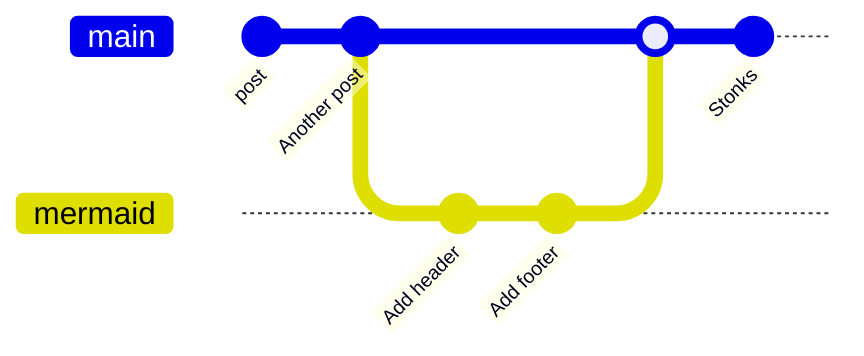

How to *Automatically* Render Mermaid JS Source Blocks.

The following guide shows how to use actual Markdown source blocks in a [Ghost blog](https://ghost.org/) and make it automatically render to a [Mermaid JS diagram](https://mermaid.js.org/).

Go to `Settings`->`Code Injection` (or better when only using it for a specific post; in the Post Settings there’s also `Code Injection`).

In the `site header` tab add the following code snippet. Make sure you use the [newest version of Mermaid](https://github.com/mermaid-js/mermaid/releases):

```html
<script src=" https://cdn.jsdelivr.net/npm/mermaid@10.9.0/dist/mermaid.min.js "></script>
```
    

Now add the following to the `site footer`:

```html
<script>
  var mElements = document.getElementsByClassName("language-mermaid");
  // the mElements collections removes the element when outerHTML is changed
  // therefore it's not an endless loop :)
  while (mElements.length >0) {
    var element = mElements[0];
    let text = element.innerHTML;
    element.outerHTML = '<div class="mermaid">' + text + "</div>";
  };
  mermaid.initialize({startOnLoad:true});
</script>
```    

This snippet replaces every `mermaid` code block with a `div` of class `mermaid`. Mermaid renders these div blocks on initialization.

And now if you add a block like:

    ```mermaid
      gitGraph
       commit id: "post"
       commit id: "Another post"
       branch mermaid
       checkout mermaid
       commit id: "Add header"
       commit id: "Add footer"
       checkout main
       merge mermaid
       commit id: "Stonks"
    ```
    

It should be rendered as follows (unless you hate Javascript or something else went wrong):



Now you can use proper source blocks while editing your markdown and even get the same experience if you publish a [Silverbullet](https://silverbullet.md/) page.
